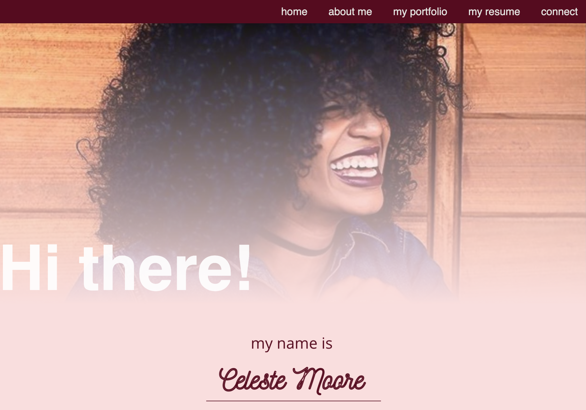

# Celeste-Moore-Portfolio

### _A primarily front-end website featuring HTML, CSS and JavaScript to illustrate my journey to a new career in tech._

## Table of Contents

- [Description](#Description)

- [Media](#Media)

- [Deployed Site](#deployed-site)

- [Features](#Features)

- [Contributors](#Contributors)

- [Contact](#Contact)

- [Project Status](#project-status)

- [License](#License)

## Media

## Deployed Site

   This is the link to view my portfolio: (https://celestealexmoore.github.io/Celeste-Moore-Portfolio/)

## Features
    - Single-page application
    - Responsive CSS to adapt to mobile devices
    - Functioning contact form that sends e-mails once submitted

## Contributors

This website was created by Celeste Moore.

## Contact

If you have any questions about this repository, contact celestealexmoore via GitHub or reach out via email:
celestealexmoore@gmail.com.

## Project Status

In Progress

---

## License

© 2021 _celestealexmoore_